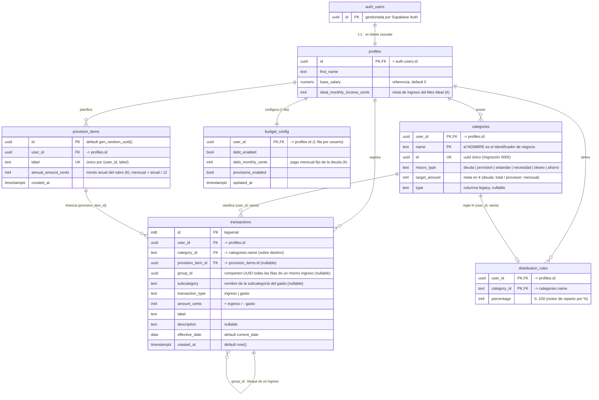

# 🗄️ Esquema de la base de datos

Modelo relacional de **Splitter · AutoSaldo** en PostgreSQL (Supabase).

- Todas las tablas viven en el esquema `public` y tienen **Row Level Security** activada:
  cada política es `auth.uid() = user_id` (o `= id` en `profiles`), así que un usuario
  **solo ve y modifica sus propias filas**.
- **Patrón _Money_:** todo importe se guarda como **entero de centavos** en columnas
  `*_cents` (`CONVENCIONES.md` §2).
- Fuente: [`docs/sql/schema.sql`](./sql/schema.sql) + migraciones `0001…0005` y la
  evolución posterior del proyecto (ver [nota final](#-estado-de-las-migraciones)).

---

## 📊 Diagrama entidad-relación



> **Notación:** `||--o{` = uno-a-muchos · `||--o|` = uno-a-cero/uno · `||--||` =
> uno-a-uno. `PK,FK` marca una columna que es a la vez llave primaria y foránea.
> Las FK de categoría son **compuestas**: `(user_id, category_id) → categories(user_id, name)`.

---

## 🔑 Llaves y relaciones

| Relación | Cardinalidad | Llave |
| :-- | :-- | :-- |
| `auth.users` → `profiles` | 1 : 1 | `profiles.id = auth.users.id` (`on delete cascade`) |
| `profiles` → `categories` | 1 : N | `categories.user_id` |
| `profiles` → `transactions` | 1 : N | `transactions.user_id` |
| `profiles` → `distribution_rules` | 1 : N | `distribution_rules.user_id` |
| `profiles` → `budget_config` | 1 : 1 | `budget_config.user_id` (PK, una fila) |
| `profiles` → `provision_items` | 1 : N | `provision_items.user_id` |
| `categories` → `transactions` | 1 : N | FK compuesta `(user_id, category_id) → (user_id, name)` |
| `categories` → `distribution_rules` | 1 : 0..1 | FK compuesta `(user_id, category_id) → (user_id, name)` |
| `provision_items` → `transactions` | 1 : N | `transactions.provision_item_id` (nullable) |
| `transactions` ↔ `transactions` | agrupación | `group_id` — **no es una FK real**: es un UUID que comparten todas las filas creadas por un mismo ingreso, para borrar el bloque de un golpe |

---

## 📋 Para qué sirve cada tabla

### `profiles`
Una fila por usuario, en relación **1:1 con `auth.users`** (la PK es el mismo `uuid`).
Guarda el nombre para saludar, `base_salary` (solo referencia) y
`ideal_monthly_income_cents`, la meta de ingreso mensual que usa la pantalla **Mes Ideal**.
Su existencia es obligatoria: el dashboard redirige a `/onboarding` si falta.

### `categories`
Los **sobres** del presupuesto. La PK es compuesta `(user_id, name)` — el **nombre** es
el identificador de negocio, y por eso `transactions` y `distribution_rules` referencian
la categoría por texto, no por uuid. `macro_type` distingue:

- `estandar` → los 3 sobres maestros del 50/30/20 (`Necesidad`, `Deseo`, `Ahorro`).
- `deuda` / `provision` → sobres del sistema para cuota fija y provisiones.
- `necesidad` / `deseo` / `ahorro` → **subcategorías** que cuelgan de un sobre maestro.

`target_amount` (¢) es la meta: monto total en las deudas, provisión mensual en las
provisiones. `id` (uuid) se añadió en la migración `0005` pero el código sigue cruzando
por `name`.

### `distribution_rules`
Porcentaje de reparto por categoría para el **motor `%` heredado**
(`POST /api/distribute`). PK `(user_id, category_id)`; `percentage` entre 0 y 100 y el
conjunto debe sumar 100. El flujo principal hoy es el 50/30/20 fijo de
`POST /api/register-income`, que **no** usa esta tabla.

### `transactions`
El **libro mayor**: una fila por movimiento. `amount_cents` es **positivo** para un
`ingreso` y **negativo** para un `gasto`, de modo que `SUM(amount_cents)` da el saldo de
un sobre. Columnas clave:

- `category_id` → nombre del sobre afectado.
- `group_id` → todas las filas generadas por **un mismo ingreso** comparten este UUID
  (el reparto 50/30/20 inserta varias filas a la vez); permite deshacer el bloque
  completo desde el Historial.
- `provision_item_id` → si el movimiento pertenece a un rubro de provisión concreto.
- `subcategory` → nombre de la subcategoría cuando el gasto se hizo contra una
  (el saldo se descuenta igual del sobre maestro `category_id`).
- `effective_date` → fecha contable (un ingreso puede diferirse a un mes futuro);
  `created_at` → cuándo se registró.

Índices por `(user_id, effective_date)`, `(user_id, created_at desc)` y
`(user_id, category_id)`.

### `budget_config`
**Una fila por usuario** (PK = `user_id`). Interruptores y montos de la parte fija del
presupuesto: si la **Deuda** está activa y su pago mensual (`debt_monthly_cents`), y si
las **Provisiones** están activas. La consume `POST /api/register-income` para saber
cuánto absorber dentro del 50 % de Necesidad.

### `provision_items`
Los **rubros de provisión** del usuario (seguros, matrícula, regalos…), cada uno con un
`annual_amount_cents`. La provisión mensual objetivo es `Σ(annual_amount_cents) / 12`.
`label` es único por usuario para no perder el `id` al re-guardar la configuración
(las transacciones lo referencian vía `provision_item_id`).

---

## 👁️ Vista `monthly_balances` (no es una tabla)

Agregado de solo lectura que alimenta el dashboard y `DashboardCharts`. Suma los
centavos de `transactions` por categoría y mes:

```sql
create or replace view public.monthly_balances
with (security_invoker = on) as
select
  t.category_id,
  extract(year  from t.effective_date)::numeric as year,
  extract(month from t.effective_date)::numeric as month,
  sum(t.amount_cents)::bigint                    as balance
from public.transactions t
group by t.category_id,
         extract(year  from t.effective_date),
         extract(month from t.effective_date);
```

`security_invoker = on` hace que la vista respete la RLS de `transactions`.

---

## 🌱 Objetos auxiliares

- **`public.crear_categorias_defecto(uuid)`** — función `plpgsql` `security invoker`
  (migración `0002`) que siembra categorías por defecto solo si el usuario no tiene
  ninguna. Hoy el *seeding* lo hace sobre todo `POST /api/seed-account` desde la app.

---

## 🧭 Estado de las migraciones

`docs/sql/` cubre el núcleo (`profiles`, `categories`, `distribution_rules`,
`transactions`, RLS, índices y la vista). La base **en producción ya evolucionó** más
allá de esos archivos; conviene añadir migraciones que documenten:

| Objeto | Dónde se usa |
| :-- | :-- |
| Tabla `budget_config` | `save-budget-config.js`, `register-income.js`, `configuracion.astro`, `mes-ideal.astro` |
| Tabla `provision_items` (+ `unique (user_id, label)`) | mismos archivos + `resumen-anual.astro` |
| `transactions.group_id`, `transactions.subcategory`, `transactions.provision_item_id` | `register-income.js`, `expense.js`, `delete-transaction.js`, `TransactionHistory.jsx` |
| `profiles.ideal_monthly_income_cents` | `update-profile.js`, `mes-ideal.astro`, `dashboard.astro` |
| `categories.id` (uuid) + `categories.type` nullable | migración `0005` |
