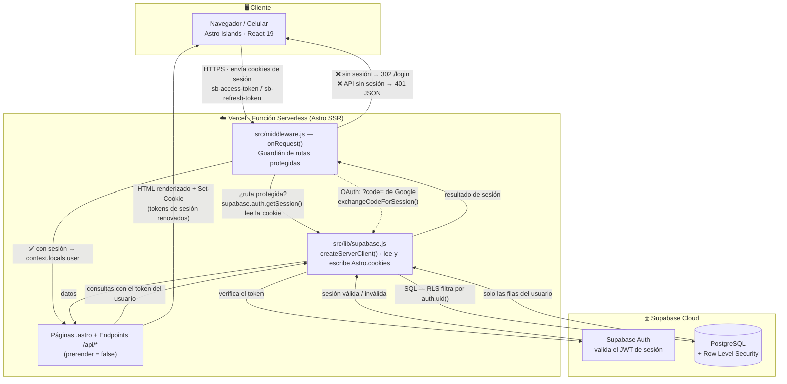

# 🏗️ Infraestructura y Arquitectura SSR

Documento de referencia sobre cómo fluye una petición en **Splitter · AutoSaldo**,
desde el navegador hasta la base de datos, y dónde se aplica la seguridad.

- **Renderizado:** Astro en modo *Server-Side Rendering* (`prerender = false` en todas
  las rutas de app), desplegado como **funciones serverless en Vercel** (`@astrojs/vercel`).
- **Sesión:** cookies HTTP gestionadas por `@supabase/ssr` a través de `Astro.cookies`.
- **Aislamiento de datos:** *Row Level Security* (RLS) en PostgreSQL — la seguridad
  vive en la base de datos, no en la aplicación.

---

## 📊 Diagrama de flujo (SSR)



---

## 📝 Explicación

### 1. El Cliente (Navegador / Celular)
La app es *mobile-first* y en Modo Oscuro. El HTML llega ya renderizado desde el
servidor; React solo se hidrata en islas puntuales (`client:load`) para formularios
y modales. En **cada petición** el navegador adjunta automáticamente las cookies de
sesión de Supabase (`sb-access-token`, `sb-refresh-token`).

### 2. El servidor de Vercel (Astro SSR)
Cada ruta de la aplicación declara `export const prerender = false`, por lo que Vercel
la ejecuta como una **función serverless** en cada request. Antes de renderizar nada,
Astro invoca `src/middleware.js`.

### 3. `src/middleware.js` — protección de rutas
`onRequest()` es el guardián central:

- Para prefijos protegidos (`/dashboard`, `/configuracion`, `/mes-ideal`,
  `/resumen-anual`, `/perfil`, `/historial`, `/api/*`) exige sesión.
- **Sin sesión:** redirige con `302` a `/login`; si la ruta es una API, responde
  `401 JSON` (no un redirect HTML).
- **Con sesión:** expone el usuario en `context.locals.user` y deja pasar la petición.
- **Callback OAuth:** si Google devuelve `?code=` en `/dashboard`, el middleware lo
  canjea por una sesión (`exchangeCodeForSession`) y limpia la URL antes de renderizar.

### 4. `src/lib/supabase.js` — comunicación segura con cookies
Crea un cliente de Supabase **por cada petición** con `createServerClient()` de
`@supabase/ssr`, conectado a `Astro.cookies`:

- `getAll()` lee las cookies entrantes para reconstruir la sesión del usuario.
- `setAll()` vuelve a escribir en `Astro.cookies` los tokens si Supabase los renueva,
  de modo que la respuesta incluye los `Set-Cookie` actualizados.
- Usa siempre la **`SUPABASE_ANON_KEY`** (nunca la `service_role`): la autoridad real
  la da el JWT del usuario, no la clave.

El cliente de navegador equivalente (`src/lib/supabase-browser.js`) solo se usa para
iniciar el login con Google y persiste la sesión en esas mismas cookies, para que el
servidor pueda leerla en la siguiente petición.

### 5. La base de datos de Supabase (en la nube)
- **Supabase Auth** valida el JWT y gestiona el ciclo de vida de la sesión.
- **PostgreSQL con Row Level Security:** cada tabla (`profiles`, `categories`,
  `transactions`, `budget_config`, `provision_items`, …) tiene políticas
  `user_id = auth.uid()`. Aunque un endpoint tuviera un bug, la base de datos **nunca
  devuelve filas de otro usuario**. El aislamiento no depende del código de la app.

### Resumen del recorrido
```
Navegador ──cookies──▶ middleware.js ──getSession()──▶ supabase.js ──▶ Supabase Auth
                             │                                              │
                   sin sesión│302 /login / 401                              │
                             ▼                                              ▼
                          Página .astro / API ──consulta (token)──▶ PostgreSQL + RLS
                             │                                              │
                             ◀──────────── solo filas del usuario ──────────┘
                             ▼
                  HTML + Set-Cookie (sesión renovada) ──▶ Navegador
```
